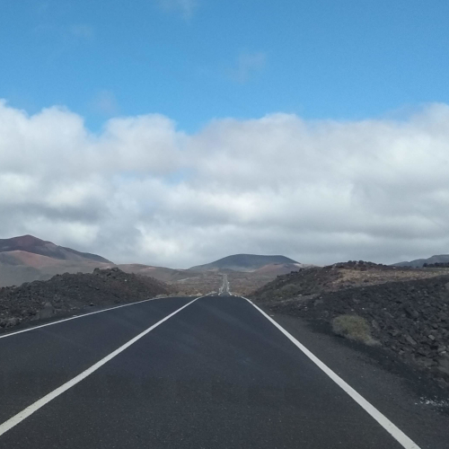

# Administrando la protección de soluciones técnicas

{:.circled}

## Potenciando la colaboración

En AEAPI creamos un espacio de encuentro para administradores de propiedad industrial, en el cual se promueve el reconocimiento de nuestras competencias mediante el intercambio de información y experiencias laborales.

[Únete a la asociación](registro){:.button}

{:.circled}

## Alcanzando metas

Trabajando para lograr el reconocimiento de la labor de los Administradores de la Propiedad Industrial en España.

[Ver más](metas){:.button}

{:.circled}

## Tejiendo una extensa red profesional

Un foro de consultas público, libre y gratuito, donde encontrar respuesta a inquietudes relacionadas con el campo de la propiedad industrial.

[Ir al foro](foro){:.button}
