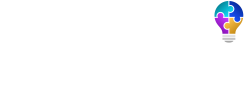
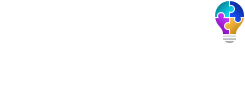

# Logos e iconos de la asociación

## Formato vectorial

Alta calidad en cualquier tamaño.

## Mapa de bits

Se recomienda no cambiar su tamaño. Compatibles en todos los medios.

### 245x111

### 122x55

