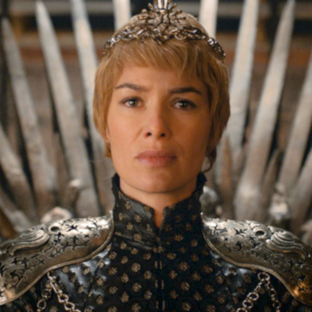
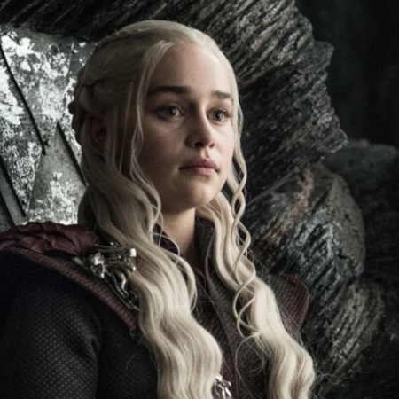
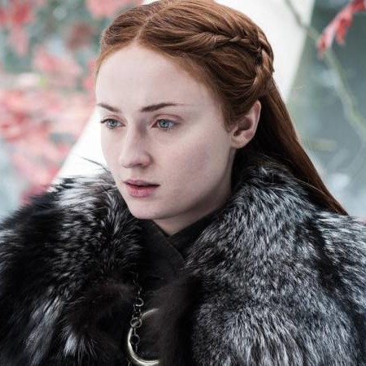
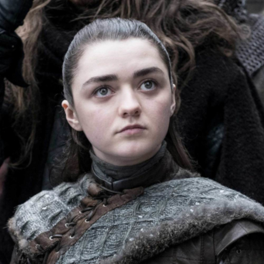

# Nuestro equipo

    

        
        
Cersei Lannister

        
Reina consorte de los Siete Reinos

    

    

        
        
Daenerys Targaryen

        
Heredera al Trono de Hierro

    

    

        
        
Sansa Stark

        
Señora de Invernalia

    

    

        
        
Arya Stark

        
Paralegal

    

